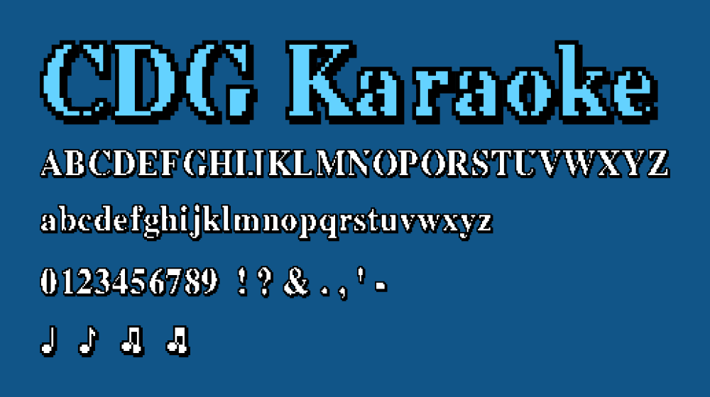

# CDG Karaoke

The words on an old karaoke screen, turned into a font. White until you sing them,
then they fill in, one word at a time, the way the machine paints the line.

## Files

- `CDGKaraoke.otf`, `CDGKaraoke.ttf` for desktop
- `CDGKaraoke.woff2`, `CDGKaraoke.woff` for the web

## How it works

Every letter comes two ways. White for a word you have not sung yet, filled in for
one you have. A karaoke player flips each word as you sing it, so the color sweeps
across the line. The four music notes stay white the whole time.

You get the usual letters, numbers, and symbols, plus those four notes. The color
is baked in, so it just shows up in any app that does color fonts. Nothing to turn
on.

## Where the letters came from

I started with Nimbus Roman Bold, a free Times knockoff. Dropped each letter onto
the chunky karaoke pixel grid, killed all the smoothing, and squished it a bit so
it sits the way it does on the screen.

## License

Free under the SIL Open Font License. Use it, embed it, change it, pass it around.
See `OFL.txt`.
